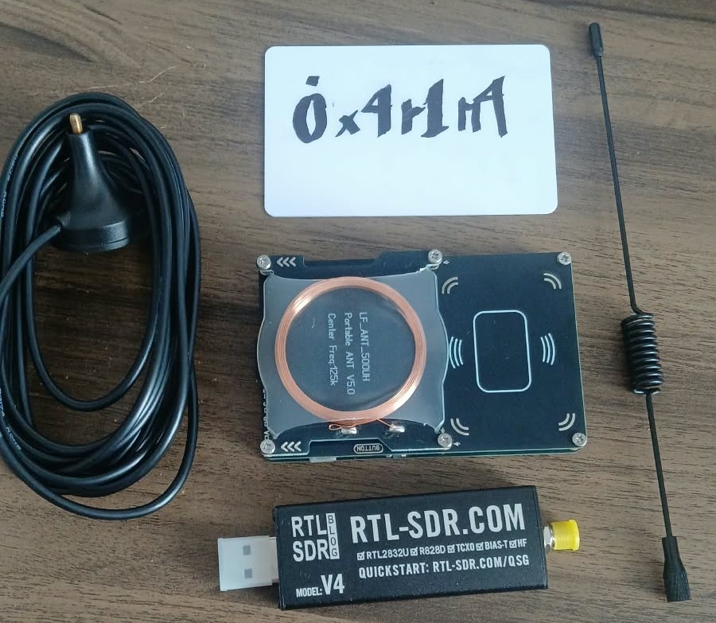
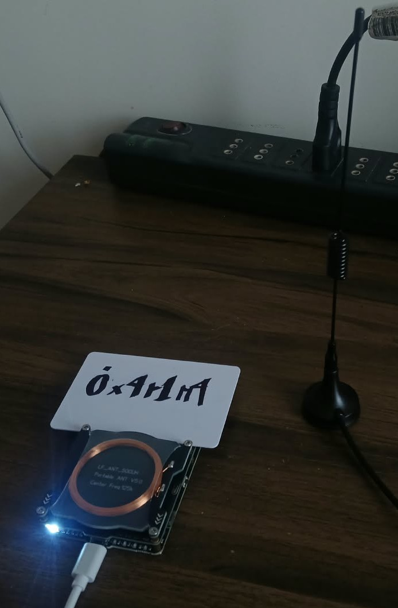
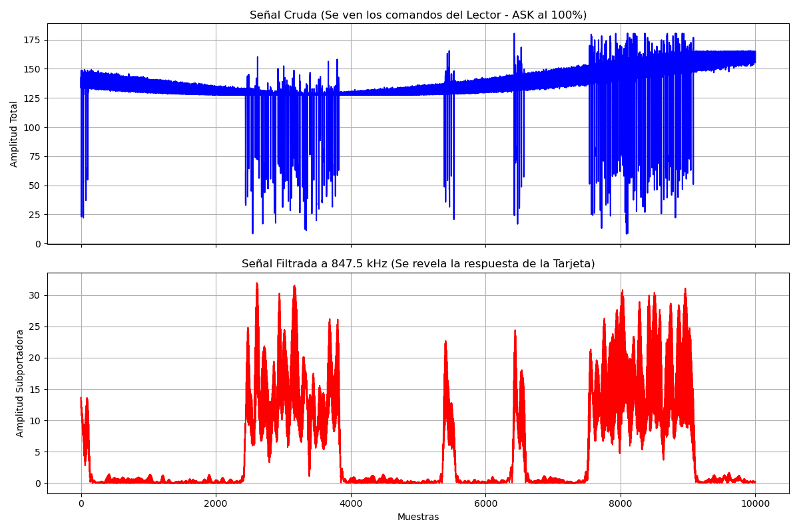

# Demodulating Mifare RFID with RTL-SDR

<div align="center">
  
</div>

This is a practical project to visualize the physical radio signals during an RFID attack. Instead of just looking at the Proxmark3 terminal output, I used an RTL-SDR to capture the raw RF over the air and a Python script to filter out the noise and reveal the card's actual response.

## Hardware & Environment
*   **Reader:** Proxmark3 Easy
*   **Target:** Passive Mifare Classic 1K card
*   **SDR:** RTL-SDR V4 (with the basic stock antenna)
*   **OS:** Fedora KDE (Bare metal)

**Setup:** 
The RTL-SDR antenna was placed less than 10 cm away from the Proxmark3 to ensure a strong signal capture.

<div align="center">
  
</div>


## Capturing the Signal

To capture the communication in real-time, I used two separate terminals.

**Terminal 1 (SDR Recording):**

This records exactly 5 seconds of raw RF data at 13.56 MHz (2 MSPS).

```bash
rtl_sdr -f 13560000 -s 2000000 -n 10000000 captura_rfid.raw
```

**Terminal 2 (Proxmark3 Attack):**

This launches the automated attack on the card using the Iceman firmware.

```bash
hf mf autopwn
```

*Quick tip:* Since the SDR only records for 5 seconds, make sure to execute the `rtl_sdr` command first, and immediately switch to the second terminal to hit enter on the `autopwn` command. This ensures the entire attack is caught in the middle of the recording.

## Processing the Data

The raw `.raw` file is dominated by the Proxmark3's strong 13.56 MHz carrier signal. Because the Mifare card is passive, its response is extremely weak and buried in that power wave.

To extract it, I wrote a Python script using `scipy` and `numpy`. The script applies a 4th-order Butterworth bandpass filter centered at **847.5 kHz** (the exact Mifare subcarrier) with a narrow 50 kHz bandwidth to strip away the carrier and isolate the card's load modulation. See the [implementation](code/) for details.

## Results

<div align="center">
  
</div>


*   **Top Graph (Blue):** The raw signal from the Proxmark3. The thick band is the constant power carrier, and the sharp drops are the 100% ASK modulation commands sent during the `autopwn` attack.
*   **Bottom Graph (Red):** The filtered 847.5 kHz signal. This reveals the Mifare card talking back. The spikes clearly show the card transmitting its data immediately after the reader finishes sending a command block.
